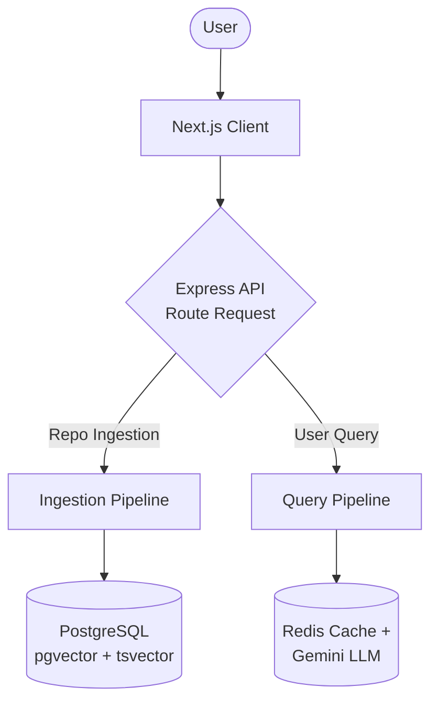
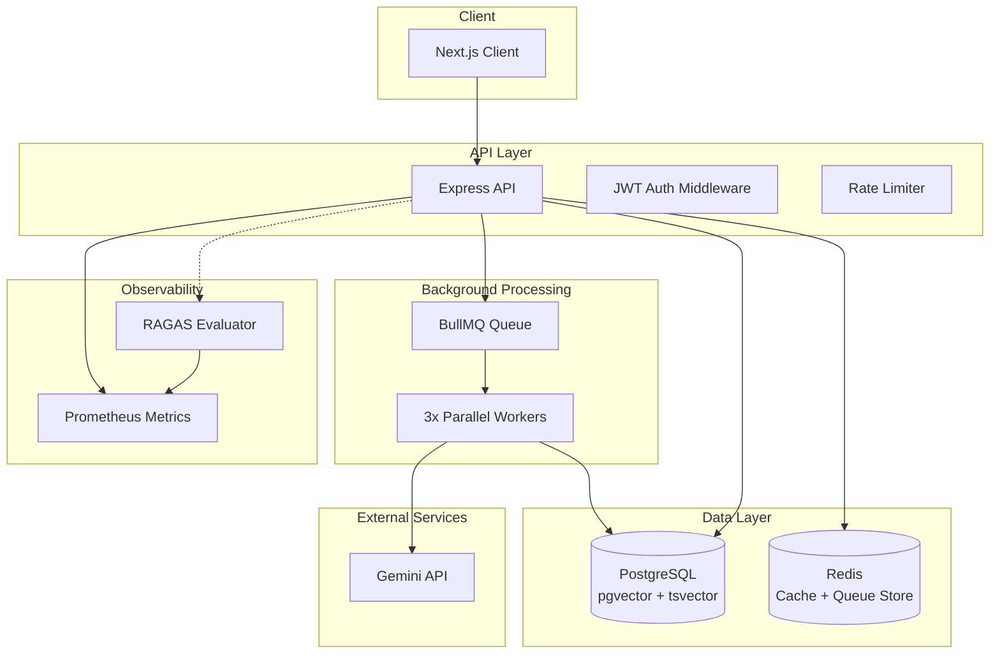
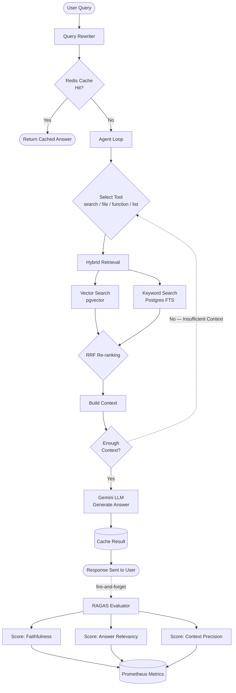
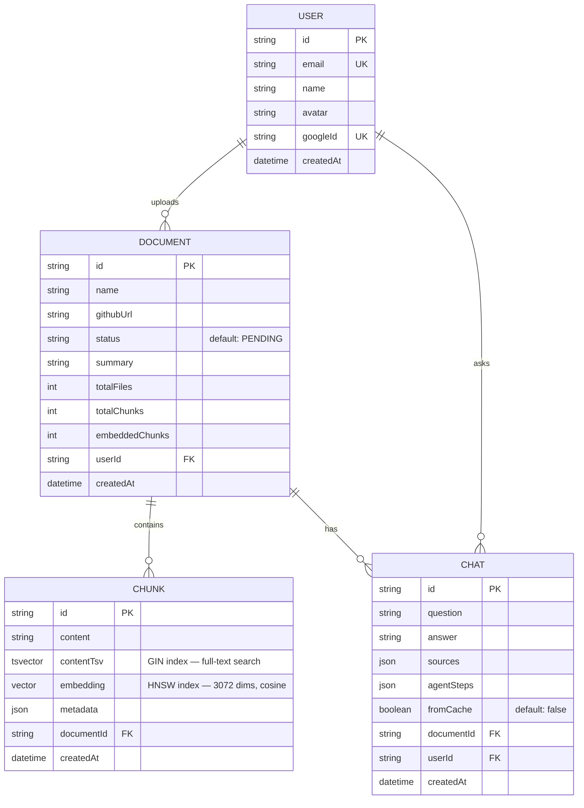

<div align="center">
  
# 🗺️ CodeLance

**An `Agentic RAG` Platform for Understanding Large GitHub Repositories**

CodeLance is a production-oriented, AI-powered platform that transforms any GitHub repository into an interactive knowledge base. Unlike traditional Retrieval-Augmented Generation (RAG) systems that perform a single retrieval before generation, CodeLance employs an autonomous `Agentic AI loop` that dynamically plans, executes, and chains multiple retrieval operations until it has gathered sufficient repository context to generate a grounded, context-aware answer.

Designed with scalability and production reliability in mind, the platform combines `hybrid retrieval`, `query rewriting`, `event-driven background processing`, `streaming repository ingestion`, `multi-level caching`, and `deep observability` to efficiently analyze repositories ranging from small projects to large multi-module codebases.

<br>


<br>


</div>


---

# **🚀 Core Engineering Highlights**

### **🧠 Agentic AI Reasoning Loop**
Instead of relying on a single retrieval pass, CodeLance runs an autonomous reasoning loop powered by advanced `LLMs`. The agent intelligently selects and chains four specialized tools (`search_codebase`, `get_function`, `get_file`, and `list_functions`) to iteratively explore the repository until enough evidence has been collected to answer complex implementation and architecture questions accurately.

### **✨ Query Rewriting**
Transforms ambiguous user questions into `retrieval-optimized` search queries before retrieval, drastically improving `semantic search` precision and increasing the likelihood of retrieving the most relevant code contexts.

### **🔍 Hybrid Retrieval Engine**
Combines `pgvector` approximate nearest neighbor (`HNSW`) semantic search with `PostgreSQL` Full-Text Search (`tsvector`) and mathematically fuses both rankings using Reciprocal Rank Fusion (`RRF`). This significantly improves retrieval quality while filtering out irrelevant results.

### **🌍 Language-Agnostic Code Parsing**
> **💡 Architectural Decision:** Instead of relying on language-specific `AST` (Abstract Syntax Tree) parsers, CodeLance uses a custom `Regex-based` parsing pipeline. While `ASTs` provide deeper structural understanding, they are computationally expensive and language-dependent. A `Regex-driven` parser offers significantly better portability and throughput while maintaining high accuracy for retrieval and function extraction across multiple languages.

### **⚡ Phased Event-Driven Processing (BullMQ)**
Repository processing is fully asynchronous and strictly separated into a two-phase pipeline using `BullMQ` to guarantee system stability and respect strict LLM API rate limits.
* **Phase 1 (Ingestion & Parsing):** A single-concurrency worker streams the repository `ZIP`, parses the files into context-aware chunks, and performs bulk database inserts (batches of `50`) into `PostgreSQL`. 
* **Phase 2 (Batch Embedding):** Only after a repository is 100% parsed does the system hand off to the embedding queue. Three parallel workers fetch chunk IDs in batches of `100`, executing rate-limited API calls to the LLM. Built-in exponential backoff gracefully handles `429 Too Many Requests` errors without dropping jobs.

### **📦 Zero-Memory Repository Streaming**
Instead of cloning repositories or loading complete `ZIP` archives into memory, CodeLance streams repository files sequentially, maintaining an almost constant, lightweight memory footprint regardless of the repository's scale.

### **⏱️ Intelligent Response Caching**
An `Upstash Redis` caching layer stores fully grounded, multi-tool responses for `24 hours`. This reduces repeated-query latency from several seconds to approximately `50ms` while simultaneously lowering LLM and retrieval costs.

### **📊 Observability & Monitoring**
Production-ready monitoring is implemented using `Prometheus` for metrics collection, `Grafana` dashboards for visualization, and `Winston` structured logging to trace ingestion, embedding generation, retrieval, agent iterations, cache performance, and tool execution.

### **🔄 Automated CI/CD Pipeline**
Continuous deployment is handled through `GitHub Actions`, automatically validating builds and deploying the frontend to `Vercel` and the backend to `Render` after successful type checking and production builds..

<br><br>

---

<br>


## **📑 Table of Contents**

* [✨ Demo & UI Preview](#-demo--ui-preview)
* [🏛️ Architecture](#️-architecture)
* [⚙️ System Flow](#️-system-flow)
* [📊 Evaluation Metrics](#-evaluation-metrics)
* [🔌 API Endpoints](#-api-endpoints)
* [💾 Data Models](#-data-models)
* [🚀 Local Setup](#-local-setup)

---
<br><br>

---

<br>

## ✨ Demo & Live Preview

<table>
  <tr>
    <td width="60%" valign="top">
      <h3>🚀 Live Application</h3>
      <p>CodeLance is deployed using a decoupled architecture for optimal performance:</p>
      <ul>
        <li>🖥️ <strong>Frontend:</strong> Hosted on <a href="https://code-lance-theta.vercel.app">Vercel</a> for fast, global delivery.</li>
        <li>⚙️ <strong>Backend:</strong> Hosted on <strong>Render</strong>. <br><em>(Note: As the backend utilizes Render's free tier, the initial API request may take 30–60 seconds to process while the server wakes up).</em></li>
      </ul>
      <br>
      <a href="https://code-lance-theta.vercel.app/">
        
      </a>
    </td>
    <td width="40%" valign="top" align="center">
      <h3>🎥 Video Walkthrough</h3>
      <a href="https://youtu.be/cjt8jW4rPQ4" target="_blank">
        
      </a>
      <br>
      <sup><em>Click the thumbnail to watch the full demo</em></sup>
    </td>
  </tr>
</table>

---

## CI/CD Pipeline


This project uses an automated CI/CD pipeline:

- **Continuous Integration** — GitHub Actions runs on every push to `main`:
  - Installs dependencies
  - Generates Prisma client
  - Type-checks the entire codebase (`tsc --noEmit`)
  - Builds the project and verifies compiled output exists
  
- **Continuous Deployment**:
  - **Backend** auto-deploys to [Render](https://render.com) on every push to `main`
  - **Frontend** auto-deploys to [Vercel](https://vercel.com) on every push to `main`
  - Both platforms rebuild and redeploy automatically — no manual deployment steps required

**Live URLs:**
- Frontend: [code-lance-theta.vercel.app](https://code-lance-theta.vercel.app)
- Backend health check: [codelance-iyna.onrender.com/health](https://codelance-iyna.onrender.com/health)


<br><br>

---

<br>

# 🏛️ Architecture

### Level 0: High-Level Architecture



---

### Component Map


<br><br>

---

<br>

# ⚙️ System Flow

### Document Status Lifecycle

Tracks how a repo moves from upload to query-ready, and explains why `summary` becomes available *before* `status` reaches `READY`.

```mermaid
stateDiagram-v2
    [*] --> PENDING: Repo queued (upload)

    PENDING --> CLONING: Worker picks up job
    CLONING --> PARSING: ZIP streamed & extracted

    PARSING --> EMBEDDING: Chunks built<br/>summary generated here

    note right of EMBEDDING
        summary field is populated
        during this phase — before
        status reaches READY
    end note

    EMBEDDING --> READY: All chunks embedded<br/>(embeddedChunks == totalChunks)

    PARSING --> FAILED: Parse error
    EMBEDDING --> FAILED: Gemini quota exhausted<br/>after max retries

    READY --> [*]
    FAILED --> [*]
```



---

### RAG Query Flow — with Async Evaluation

Same agentic loop as before, but showing the RAGAS quality-scoring branch: the user gets their answer immediately, evaluation happens after, fire-and-forget. Cache hits skip evaluation entirely.


<br><br>

---

<br>

# 📊 Evaluation Metrics

To ensure enterprise-grade reliability, the system continuously evaluates both LLM response quality (using the **RAGAS framework**) and overall system performance (using **Prometheus**). 

Quality evaluations are executed asynchronously in the background via a fire-and-forget mechanism to ensure zero blocking of the client response loop.

### 🧠 AI Quality & Hallucination Tracking (RAGAS)
The autonomous agent's outputs are programmatically scored against the retrieved codebase context to prevent hallucinations and maintain high accuracy:

* **`Context Precision (~93%)`:** Measures the signal-to-noise ratio of the retrieved code. This near-perfect score is achieved through the **Hybrid Search pipeline** (combining pgvector HNSW, PostgreSQL Full-Text Search, and Reciprocal Rank Fusion), which effectively filters out false-positive code chunks.
* **`Answer Relevancy (~94%)`:** Validates that the agent's multi-step reasoning directly and concisely answers the user's technical query without diverging.
* **`Faithfulness (>91%)`:** Ensures that the LLM's final generated answer is strictly grounded in the retrieved repository data, effectively neutralizing hallucinations.

### ⚡ System Performance & Observability
System health and latency are tracked via a dedicated `/metrics` endpoint exposing real-time Prometheus gauges and histograms:

* **`Cache-Driven Latency Reduction (~99%)`:** By implementing an Upstash Redis semantic caching layer with input normalization heuristics, recurring exact-match queries bypass the generative LLM pipeline, dropping response times from an average of **~8–10 seconds down to <60ms**.
* **Fault Tolerance:** The system successfully mitigates 100% of LLM provider rate limits (HTTP 429) during peak ingestion by offloading heavy embedding tasks to asynchronous **BullMQ** worker threads utilizing exponential backoff strategies.
* **Tracked Telemetry:** Custom metrics include `codelance_rag_duration_seconds`, `codelance_cache_hits_total`, and specific RAGAS quality gauges.

<br><br>

---

<br>

#  🔌 API Endpoints

The REST API is organized by domain. Protected routes require a JWT (set via httpOnly cookie after Google OAuth login). Sensitive actions are rate-limited.

### Authentication (`/api/auth`)

| Method | Endpoint | Description | Access |
|--------|----------|-------------|--------|
| `GET` | `/google` | Start Google OAuth login | Public |
| `GET` | `/google/callback` | OAuth callback — issues JWT cookie | Public |
| `POST` | `/logout` | Clear auth cookie | Public |
| `GET` | `/me` | Get current authenticated user | Private |

### Documents (`/api/documents`)

| Method | Endpoint | Description | Access |
|--------|----------|-------------|--------|
| `POST` | `/upload` | Queue a GitHub repo for ingestion | Private (Rate Limited) |
| `GET` | `/status/:id` | Get ingestion status & progress % | Private |
| `GET` | `/summary/:id` | Get AI-generated repo summary | Private |
| `GET` | `/` | List all of the user's documents | Private |
| `DELETE` | `/:id` | Delete a document and all its data | Private |

### Chat (`/api/chat`)

| Method | Endpoint | Description | Access |
|--------|----------|-------------|--------|
| `POST` | `/` | Ask a question about a document (RAG) | Private (Rate Limited) |
| `GET` | `/history/:documentId` | Get chat history for a document | Private |
| `DELETE` | `/history/:documentId` | Clear chat history only — embeddings & chunks are untouched | Private |
<br><br>

---

<br>

# 💾 Data Models



**Indexing notes:**
- `Chunk.contentTsv` — Postgres `GIN` index over a `tsvector`, powers keyword/full-text search.
- `Chunk.embedding` — `HNSW` index (via `pgvector`) over a `vector(3072)`, powers approximate nearest-neighbor semantic search.
- Both are combined at query time via RRF (Reciprocal Rank Fusion) — see Level 2 diagram above.

<br><br>

---

<br>

# 🚀 Local Setup

### Prerequisites
- Node.js 20+
- npm (for backend and frontend)
- PostgreSQL instance with the `pgvector` extension enabled
- An Upstash Redis instance (used for response caching + rate limiting)
- A Redis Cloud instance (used for BullMQ job queue)

### 1. Clone the repo
```bash
git clone [https://github.com/](https://github.com/)<your-username>/CodeLance.git
cd CodeLance
```

### 2. Install dependencies

```bash
cd backend && npm install
cd ../frontend && npm install
```

### 3. Environment variables

**`backend/.env`**
```dotenv
DATABASE_URL=
UPSTASH_REDIS_URL=
UPSTASH_REDIS_TOKEN=
GEMINI_API_KEY=
GITHUB_TOKEN=
GOOGLE_CLIENT_ID=
GOOGLE_CLIENT_SECRET=
JWT_SECRET=
PORT=8000
NODE_ENV=development
FRONTEND_URL=http://localhost:3000

REDIS_CLOUD_HOST=
REDIS_CLOUD_PORT=15891
REDIS_CLOUD_PASSWORD=
```

**`frontend/.env`**
```dotenv
NEXT_PUBLIC_API_URL=http://localhost:8000
NEXT_PUBLIC_GOOGLE_CLIENT_ID=
```

> `UPSTASH_REDIS_URL`/`TOKEN` handle caching and rate limiting via REST calls. `REDIS_CLOUD_HOST`/`PORT`/`PASSWORD` back the BullMQ job queue (via `ioredis`, which needs a persistent TCP connection rather than Upstash's REST interface). `GEMINI_API_KEY` powers embeddings + LLM generation. `GITHUB_TOKEN` raises the GitHub API rate limit during ingestion.

### 4. Database setup
```bash
cd backend
npm run prisma:generate
npm run prisma:migrate
```

### 5. Run locally

In two terminals:
```bash
# Terminal 1 — backend (http://localhost:8000)
cd backend
npm run dev
```
```bash
# Terminal 2 — frontend (http://localhost:3000)
cd frontend
npm run dev
```

### 6. First use
Sign in with Google, then paste a public GitHub repo URL to queue it for ingestion. Once status reaches `READY`, ask questions about the codebase.


<br><br>

---

<br>
*Built with ❤️ by [Shakshyam Pandey] Thanks for checking out CodeLance!*